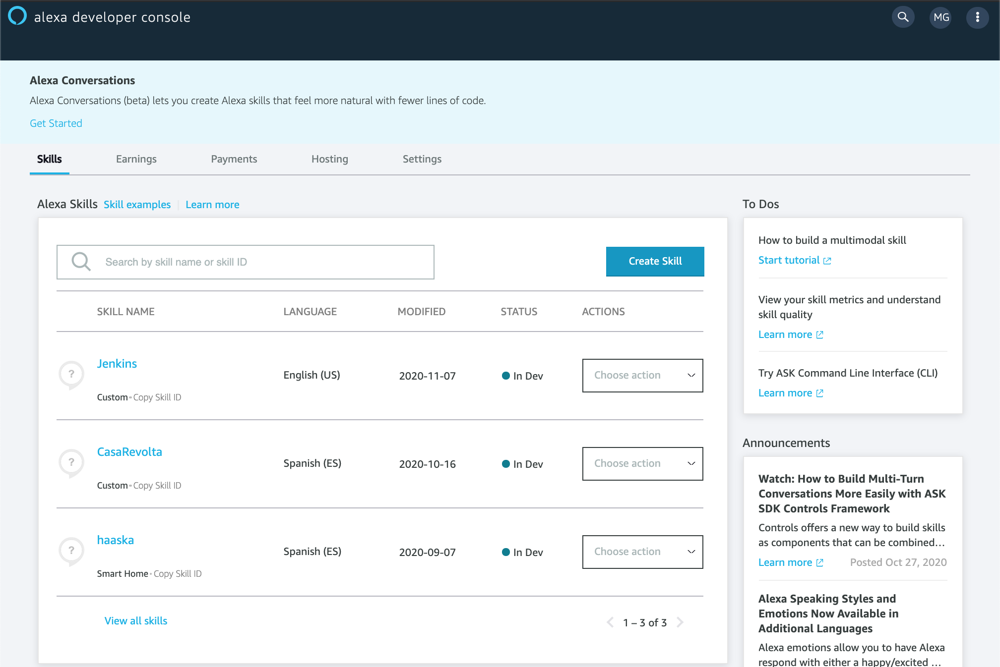
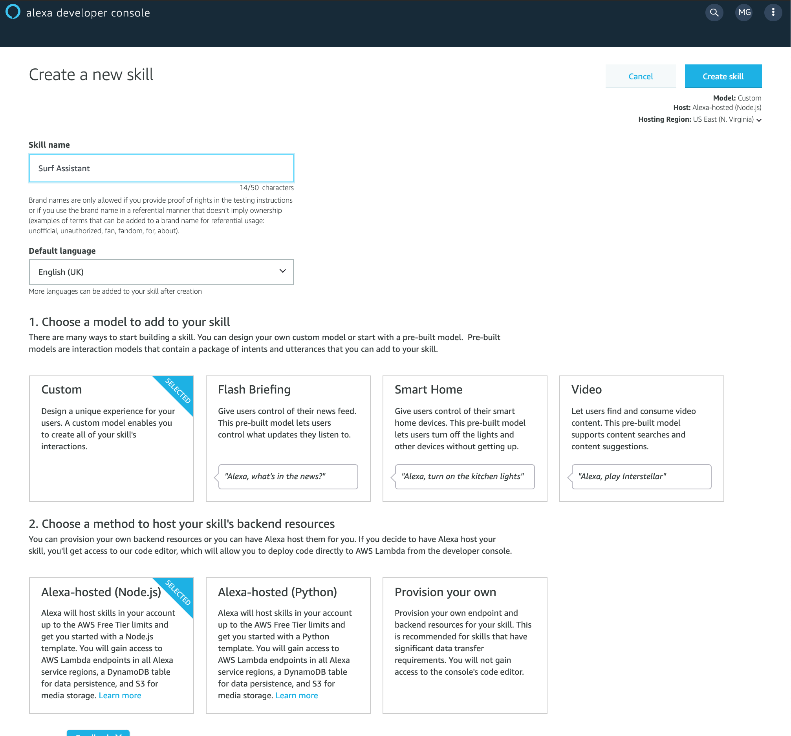
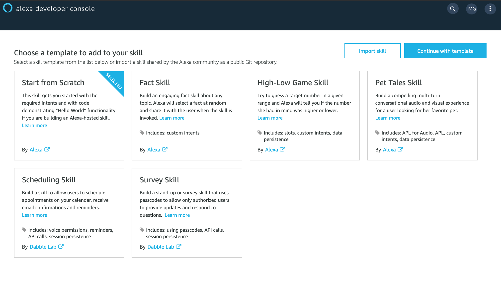
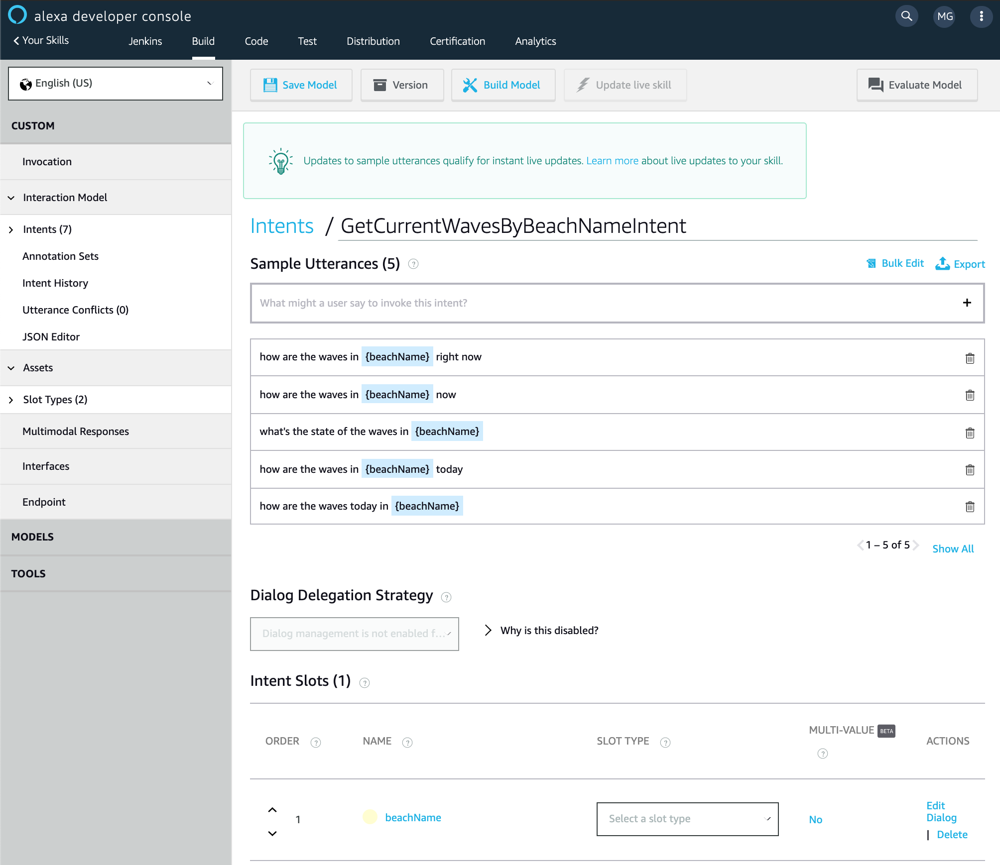
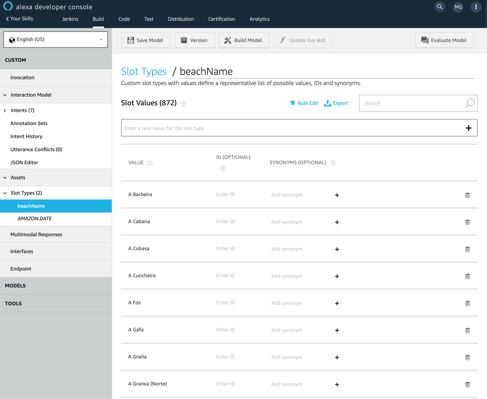
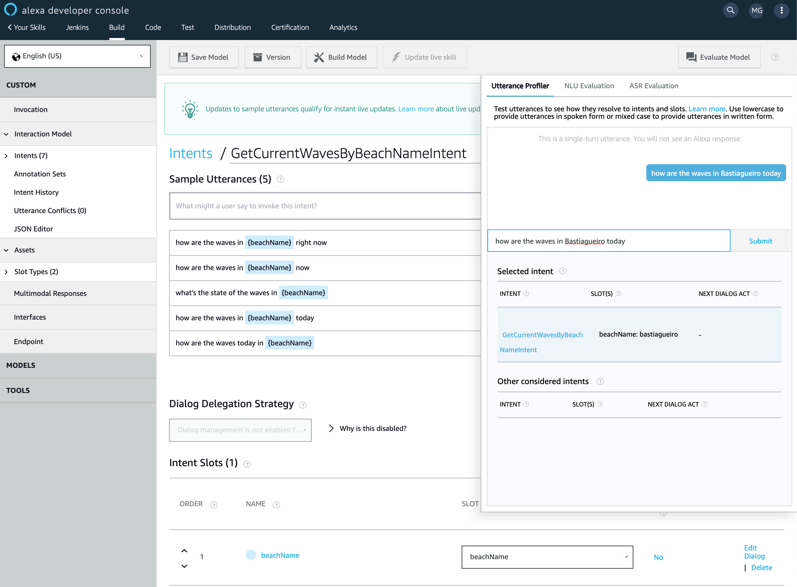
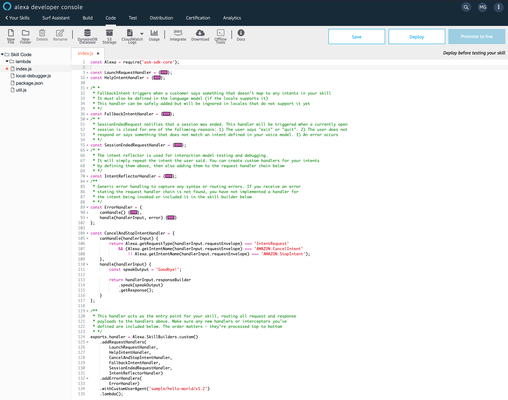
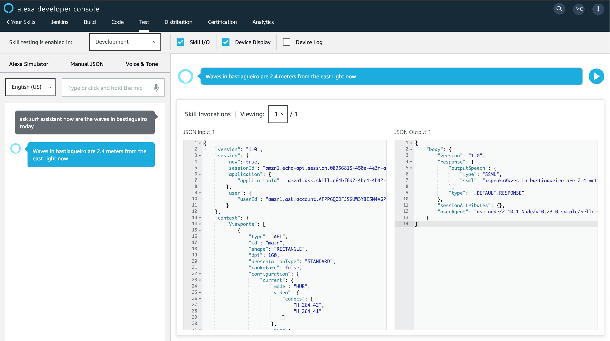

Voice assistants are becoming more and more popular by the day.

It started in our phones, but now they've made it into the speakers of our homes and cars, ready
to answer our questions and follow our commands.

For their users, voice assistants provide a convenient hands-free way of performing
certain action like playing a song, checking the traffic reports, setting reminders or turning lights on and off.

For companies this convenience also provides a novel way for generating engagement,
sometimes more so than webs or phone apps themselves.

In Alexa, the most popular voice assistant today, voice apps are named "skills" and
can be installed in a few clicks (or voice commands) just like apps can be installed
in phones through app stores.

Creating a great skill has a learning curve as any task, but if you haven't yet created
one I bet the curve is less steep than you might think. To demonstrate that I'm going
to create a personal skill just for myself that allows me to check the waves on any beach
of my region to decide if it's a good time get my surfboard and hit the waves 🏄🏻‍♂️ or not
so much.


## Motivation

Of the three main voice assistants Alexa is by a fair margin the one that is supported by more devices. On top of that, and although this is personal and perhaps depends on the language you interact with voice assistants, it's also the one with the more natural voice. As picky as that may sound, it made me enjoy talking to Alexa in a matter of days more than I ever enjoyed using Google Assistant in several years that I had it in my phone.

I've since then created a few skills to automate my home and daily routines and now I wanted to create one to automate the fun parts.

## Prerequisites

To follow this tutorial you will need an account on couple amazon services.

First, you need to login or sign up on https://developers.amazon.com, but worry not, if you have a
regular amazon account you can login in with that account here already. This one is mandatory.

Second, you will need to open an account in https://aws.amazon.com/ in case you don't have one.
This one is not mandatory but for this quick demo it's the quickest way to get you up and running fast.
The reason is that Alexa skills need a backend and we're going to use AWS Lambda for it, both because
it's very convenient as both are Amazon products that integrate easily and it will be free because
you get one million free requests per month.

If you don't have an account, this time your regular amazon account won't work, you'll have to open
a new one which at some point will require you to enter payment details like a credit card, but as
mentioned above you'd have to send 25 Alexa commands every minute non-stop for a month to get charged.

You don't need to own an Alexa smart speaker at any point of this tutorial as you can test your progress
with the skill using text or your laptop's microphone. If you want to install and use the skill once
you've finished it you can download the Alexa app in your phone to have it in your pocket.

## What are we building?

I live in Galicia, a region in NW Spain that 1500km (~930 miles) of coast, many of which are beaches facing the Atlantic ocean, with very good conditions for surf.

I wanted to create custom skill that allowed me to ask Alexa about the sea forecast (waves height and direction mostly) on a particular beach on a particular date (or right now!), so I could decide wether or not it's worth getting the board and heading to the beach or help me decide to what beach to should go.

That simple skill will read the sea forecast from an open API that the local meteorological institute provides, which has references for over 870 beaches in the region.

I'm not going to show how I crunch the JSON data that this API returns as it's not really interesting but something any javascript developer could do with sine amount of patience inversely proportional of how good the API docs are.

## First step: Creating the skill

Once you've logged into https://developers.amazon.com and clicked on the **Amazon Alexa** section of the dashboard, you will be in portal for Alexa developers. From there you can open the Alexa console what will take you to your list of skills.





You click on the "Create Skill" button and choose a two-word name for the skill. That name will be _invocation_ of your skill, that is the key word you need to use so Alexa knows what skill you're invoking. More on that later.

Let's name our skill _Surf Assistant_. In there we're also going to select the **language** in which we're going to interact with the skill (_English - UK)_, the **model** for your skill (_Custom_), the host for your skill's backend, (_Alexa-hosted - Node.js)_ and hit **Create skill**.

Alexa-hosted is just a friendlier way of saying _AWS Lambda_.

It's important to note that in here you can also choose the region. It's important to note that depending on the language you choose, some may not be available in all regions. For instance for european Spanish you should choose _EU (Ireland)_.





In the next step you're going to select **Start from scratch**





You have your skill created! Now we have to create an **Interaction model**. That is just a fancy

## Second step: Create your interaction model.

In essence Alexa skills follow a very simple pattern.

You define a list of commands that your app will know how to handle, called **Intents** and for each one of them you define many **Utterances**, that is all the phrases you can imagine users will say to convey that command. That is necessary because human languages are flawed, there are many ways of saying the same thing and users may convey the same order using completely different sentences.

Let's see it with an example.

We want to create an _intent_ for when the user wants to check the sea status right now on a specific beach. Following conventions it should be camel-cased and end in **Intent** so we're going to name it **GetCurrentWavesByBeachNameIntent**.





Inside the intent is where you add examples what users could say to trigger this intent. Those are called **Utterances**.
Later on Alexa's algorithm will process the utterances create a model that really understands the sentences, so it will recognize what the user means most of the time. Even if the user phrases things a little bit different from how we anticipated, uses synonyms or changes the order of a few words most of the time Alexa will be able to understand the order but the more utterances you provide the smarter the algorithm will be.

There's another detail we haven't dealt with yet. Since this _intent_ needs the name of a beach we want the forecast of, we have to define a **Slot**, which we delimitate with braces.

A **Slot** that is a part of the sentence that is variable and has to be extracted and made available to our backend later on.

Slots need to have associated a type. Alexa defines many built in types for the most common usages like numbers, dates, ordinals and phone numbers... but also a lot more that are very specialized: actors, airports, countries, fictional characters... You can check the full list [here](get-current-waves-by-breach-name-intent).

For now our `{{beachName}}` slot has no type associated, and it needs one.
Since Alexa doesn't has a built in slot type for all the names of the 873 galician beaches, we can always create our own slot type and populate it with all the possible options:





If you only have a few values you can populate it using the UI, but if you have hundreds like in this case it's far more convenient to upload a CSV file, which I crafted using the data from the forecast API and uploaded using the **Bulk Edit** option. Once the slot type is created you can assign to the slots you created on the previous step.
Slots teach Alexa how to recognize words like names or places are not part of any dictionary and would otherwise have a hard time understanding.

That's it, now we can click **Save** and **Build Model** on the top menu and once it has finished click on the **Evaluate Model** to give it a go.





On the _Utterance profiler_ you can type a sentence and check what _intent_ Alexa recognized the value
of the slots and other possible intents it considered.

Now that Alexa understands intents, it's the time to write actual code to handle what happens when the user speaks that.

## Third step: Handling intents.

To write the code we're not even going to spin up our preferred code editor yet, we are going to click on the *Code* tab on the
top menu which will take us to a online code editor with an already functional template code.





The code is easy to grasp. There are a bunch of objects all ending on `Handler`, one for each
of the default intents every app must implement, like `CancelAndStopIntentHandler` or `ErrorHandler`.

All the handlers have to function properties: `canHandle` and `handle`.

The names are pretty self explanatory but `canHandle` is the one in charge of deciding wether a call
be handled by that handler and `handle` does the actual work.

You don't need to modify the basic ones, instead you just have to add a new handler for the `GetCurrentWavesByBeachNameIntent`
we added to our model and then pass it to `Alexa.SkillBuilders.custom().addRequestHandlers`.

Let's see the final code.

```js
const Alexa = require('ask-sdk-core');
const fetch = require('node-fetch');

const MeteoSixApiKey = 'SECRET'; // Secret API key for the public weather forecast service.

function getWaves(beachName) {
    return fetch(`http://servizos.meteogalicia.es/apiv3/findPlaces?location=${beachName}&types=beach&API_KEY=${MeteoSixApiKey}`)
        .then(response => response.json())
        .then(json => json.features[0].properties.id)
        .then(id => fetch(`http://servizos.meteogalicia.es/apiv3/getNumericForecastInfo?locationIds=${id}&variables=significative_wave_height,mean_wave_direction&API_KEY=${MeteoSixApiKey}`))
        .then(response => response.json());
}

function generateWaveStatusSentence(prediction) {
    // Boring code extract meannful data from a forecast.
    return `${waveHeight} meters from the ${direction}`;
}

function getPredition(data, date) {
    // Boring JSON crunching to the the prediction for the given moment.
}

const GetCurrentWavesByBeachNameIntentHandler = {
    canHandle(handlerInput) {
        return Alexa.getRequestType(handlerInput.requestEnvelope) === 'IntentRequest'
            && Alexa.getIntentName(handlerInput.requestEnvelope) === 'GetCurrentWavesByBeachNameIntent';
    },
    handle(handlerInput) {
        let slots = handlerInput.requestEnvelope.request.intent.slots;
        let beachName = slots.beachName.value;

        return getWaves(beachName)
            .then(data => generateWaveStatusSentence(getPredition(data)))
            .then(str => `Waves in ${beachName} are ${str} right now`)
            .then(phase => handlerInput.responseBuilder.speak(phase).getResponse());
    }
};

// ...

exports.handler = Alexa.SkillBuilders.custom()
    .addRequestHandlers(
        LaunchRequestHandler,
        GetCurrentWavesByBeachNameIntentHandler, // add new handler
        HelpIntentHandler,
        CancelAndStopIntentHandler,
        FallbackIntentHandler,
        SessionEndedRequestHandler,
        IntentReflectorHandler)
    .addErrorHandlers(
        ErrorHandler)
    .withCustomUserAgent('sample/hello-world/v1.2')
    .lambda();
```

Let's break that down.

Our handler's `canHandle` function returns true when the _intent_ is **GetCurrentWavesByBeachNameIntent** and
the `handle` function extracts the value of the slot from `handlerInput.requestEnvelope.request.intent.slots`, which
is how the Alexa API wraps things.

From that point the rest of the function is just regular Javascript code. I call some API, I extract the
information I want from the returned JSON and build the response sentence.

Finally, and this is the last bit of the demo that is Alexa-specific, you pass that sentence you want Alexa to
speak to `handlerInput.responseBuilder.speak(phrase).getResponse()`.

Don't forget to add the handler you've just defined to `.addRequestHandlers()` and the end of the file and you're done.

If you need to install third party libraries like I did with `node-fetch` you add them to your list of dependencies
on the `package.json` like on any Node.js project and AWS will take care of installing them when you deploy.


## Final step: Deploy, test and publish.

The deploy part is very simple. Click the **Deploy** button on the top-right corner of the screen above the code editor.

To test the app we go to the **Test** tab on the top menu.



You can either type or use the microphone and Alexa will respond. You also have nice panels to see the parsed input
sent to your lambda function and the response returned by it, which can come handy sometimes.

Note that unlike the **Evaluate Model** interface you used while creating your voice model, in here you have to type (or speak)
the _invocation_ of your skill.

You don't just say _How are the waves in Bastiagueiro today_, but `_Ask surf assistant how are the waves in Bastiagueiro today_.

This is necessary so Alexa knows what skill you're invoking and use the right voice model. There's an experimental feature to remove
this requirement but for now is not available in all languages and regions.

The last step is to install your skill into your Alexa account, which should make it available on all your Alexa devices.

You can do it on https://alexa.amazon.com, going to to **Skills** menu, then to **My Skills** and then to **Developer Skills**,
where you will see **Surf Assistant** ready to be installed.

Do it and start using it!

## Wrapping up

That's it, in a matter of hours we've create an app that lives on smart speakers and user machine learning to
understand voice commands and tell you the surf conditions on a beach of your choice.

How cool is that? Just a few years ago building something similar in such little time looked that taken
out of bad "hacker" movie.

Recently I found myself creating custom skills to improve my smart home, allowing me to ask how until the laundry is done